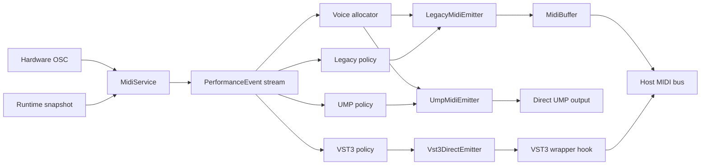

# Requirements

### Overview & Goals
Yes — rethinking `Source/Core/MidiProtocol.h` before adding the VST3 path makes sense, but the best shape is **not** a straight rename of the current interface to `EventProtocol`.

The current `MidiProtocol` API already mixes three different responsibilities:
- **semantic musical output** such as note on/off and expression (`MidiProtocol.h:11-24`)
- **transport/session setup** such as `setup()` and `addIdentification()` (`MidiProtocol.h:26-28`, `Midi2Protocol.cpp` identification block)
- **voice routing state** such as `findMidiChannelForNewNote()`, `releaseMidiChannel()`, and `setRemoteSupportsPerNote()` (`MidiProtocol.h:30-33`)

For the new plugin mode, the clean direction is:
- keep a **transport-independent event layer** for high-resolution note/expression intent
- keep **transport adapters** that render those events as Legacy MIDI/MPE, direct UMP, or VST3-native events
- move **channel/note-ID allocation and transport-specific negotiation** out of the shared event interface

### Scope
#### In Scope
- Introduce a transport-independent event model in `Source/Core` for note lifecycle and expression.
- Refactor `MidiService` so its core logic no longer depends on `juce::MidiBuffer` as the only output representation.
- Keep three output adapters in view:
  - `LegacyMidi` for the current plugin-safe MIDI path
  - `UmpMidi` for the existing standalone direct UMP path
  - `Vst3Direct` for the new plugin-only enhanced host-output path
- Separate standalone-only UMP session responsibilities from shared event generation.
- Preserve processor-owned state and headless plugin behavior.

#### Out of Scope
- Exposing raw UMP packet transport through the plugin MIDI output bus.
- Forcing VST3-specific concepts like `noteId` or note expression into the standalone direct-endpoint path where they do not fit naturally.
- Reworking unrelated hardware/UI architecture beyond what is needed to separate event generation from transport emission.

### Functional Requirements
- Legacy plugin output must continue to use the current host-compatible MIDI path by default.
- Standalone must keep its existing legacy/MPE mode and direct UMP mode.
- The shared event layer must preserve enough detail for:
  - note on/off with velocity
  - channel-wide vs per-note pitch/expression intent
  - controller-style expression that may map differently per transport
  - timing/sample offset
- Expression-update density control must be transport-specific:
  - Legacy MIDI should be able to keep coarse CC throttling/quantization to protect broad device and host compatibility
  - direct UMP and `Vst3Direct` should be free to use different thresholds, higher resolution, or no CC-style decimation where the transport can sustain it
- Transport-specific features must remain optional:
  - standalone UMP identification / endpoint notifications stay UMP-only
  - VST3-native note-expression output stays VST3-only
- If a transport cannot represent a high-resolution event exactly, its adapter must degrade it predictably to the existing safe behavior.

### Non-Functional Requirements
- Preserve real-time safety in `Source/PluginProcessor.cpp:306-340` and `MidiService` block processing.
- Keep the refactor incremental so the current Legacy MIDI path can act as the regression baseline.
- Minimize JUCE wrapper customization blast radius by isolating VST3-specific emission behind a narrow adapter/hook.

# Technical Design

### Current Implementation
- `Source/Core/MidiProtocol.h:7-34` is buffer-oriented and assumes every output path writes directly into `juce::MidiBuffer`.
- `Source/Core/MidiService.h:26-31` stores the chosen protocol inside `RuntimeConfigSnapshot`, which means event-generation and transport choice are currently bundled together.
- `Source/Core/MidiService.cpp:77-85` constructs either `Midi1Protocol` or `Midi2Protocol` at startup and immediately calls `protocol_->setup(pendingMidiBuffer_, mpeZone_)`.
- `Source/Core/MidiService.cpp:1174-1245`, `1259-1273`, and `1411-1434` pass both `juce::MidiBuffer&` and `MidiProtocol*` through core note/expression helpers, so the service currently decides musical intent and final transport encoding at the same time.
- `Source/Core/MidiService.cpp:406-418` throttles active note-hold updates with a shared `messageCount >= 64` rule before calling `createNoteHold()`, and `createNoteHold()` resets the counter at `1377-1385`.
- `Source/Core/MidiService.cpp:1387-1435` then emits full normalized expression values, while the actual resolution loss happens later in the protocol implementation (`Midi1Protocol.cpp:37-40` scales CC to 7-bit; `Midi2Protocol.cpp:92-103` sends 32-bit CC / per-note controller values).
- `Source/Core/Midi1Protocol.cpp:64-77` uses `setup()` to emit MPE zone-layout messages and configure `juce::MPEChannelAssigner` state.
- `Source/Core/Midi2Protocol.cpp:139-195` uses `addIdentification()` to emit direct-endpoint UMP identification/function-block packets, which are meaningful for standalone UMP output but not for plugin host output.
- `Source/Core/Midi2Protocol.cpp:197-226` changes channel assignment behavior based on `remoteSupportsPerNote_`, showing that note-routing policy is also embedded in the protocol class.
- `Source/PluginProcessor.cpp:310-337` already distinguishes standalone direct UMP from normal plugin MIDI output, so the plugin/standalone split exists at the processor boundary.
- `JUCE/modules/juce_audio_plugin_client/juce_audio_plugin_client_VST3.cpp:3630-3632` and `juce_VST3Common.h:1404-1447` confirm that the default plugin path only converts `juce::MidiBuffer` into legacy-style VST3 events.

### Key Decisions
1. **Refactor around a semantic event model before adding `Vst3Direct`.**  
   The current `MidiProtocol` interface is too transport-shaped to cleanly host a third VST3-native implementation.
2. **Do not simply rename `MidiProtocol` to `EventProtocol` and keep the same methods.**  
   `setup()`, `addIdentification()`, and channel-allocation methods are not transport-neutral event operations.
3. **Split responsibilities into event generation, voice allocation, and transport emission.**  
   This matches the way `MidiService` currently mixes those concerns and will make the VST3 path additive rather than invasive.
4. **Keep Legacy MIDI, UMP, and VST3 Direct as adapters over the same event stream, but give each adapter its own expression-emission policy.**  
   The shared event model should stay high-resolution; transport adapters should decide how aggressively to thin, quantize, or forward continuous updates.
5. **Move the current `messageCount >= 64` throttling rule out of `MidiService` and into transport-aware adapter policy.**  
   A global cadence makes sense for 7-bit Legacy MIDI, but it is too restrictive as a universal rule once UMP and VST3-native output are introduced.
6. **Treat `Vst3Direct` as a plugin-only adapter behind the processor/wrapper boundary.**  
   It should consume the same event model, but it must not inherit standalone UMP responsibilities like endpoint identification.

### Proposed Changes
- Replace the current single-protocol design with four layers:
  1. **Performance event model** in `Source/Core` describing note, pressure, pitch, CC-like expression, transport controls, and timing.
  2. **Voice-allocation / note-tracking helpers** that decide MPE channel use for Legacy/Ump paths and stable `noteId` handling for VST3.
  3. **Expression-emission policy** per transport that decides when a continuous value change is significant enough to emit.
  4. **Transport emitters/adapters** that translate the semantic events into concrete outputs.
- Refactor `MidiService` so helpers such as `createNoteOn/Off`, `createMidiMsgOn/Off`, `addMidiValueMessage`, and `addStripValueMessage` build semantic events first, rather than writing immediately into `juce::MidiBuffer`.
- Remove the current global `messageCount >= 64` note-hold cadence from `processNoteKey()` and let the selected output adapter decide whether to emit every update, quantized updates, or thresholded changes for pressure/yaw/roll/CC-style messages.
- Keep transport-specific control flows separate:
  - MPE layout setup remains part of Legacy/Ump transport initialization.
  - UMP identification and remote per-note negotiation stay in a UMP-specific transport/session component.
  - VST3-native output gets its own direct event queue and wrapper flush path.
- Update `RuntimeConfigSnapshot` in `MidiService.h` so it no longer stores only a `shared_ptr<MidiProtocol>`; it should hold the semantic rendering context needed by the active transport path.
- Preserve the current default plugin path by keeping a Legacy MIDI adapter that still writes to `juce::MidiBuffer` and uses JUCE’s existing `pluginToHostEventList` conversion.

### Data Models / Contracts
Suggested split:

```cpp
enum class OutputTransportMode {
    LegacyMidi = 0,
    UmpMidi = 1,
    Vst3Direct = 2,
};

enum class PerformanceEventKind {
    NoteOn,
    NoteOff,
    Pitch,
    Pressure,
    Controller,
    ProgramChange,
    TransportCommand,
};

struct PerformanceEvent {
    PerformanceEventKind kind;
    int channelHint = -1;
    int noteNumber = -1;
    int noteId = -1;
    int controller = -1;
    float value = 0.0f;
    bool perNote = false;
    int sampleOffset = 0;
};

struct ExpressionEmissionPolicy {
    int minMessageStride = 1;
    float minNormalizedDelta = 0.0f;
    bool quantizeToTransportResolution = false;
};
```

Suggested responsibilities:

```cpp
class PerformanceEventSink {
public:
    virtual void pushEvent(const PerformanceEvent& event) = 0;
};

class VoiceAllocator {
public:
    virtual int beginNote(MidiChannelType outputType, int noteNumber) = 0;
    virtual void endNote(MidiChannelType outputType, int noteNumber, int channelOrVoice) = 0;
};

class ExpressionPolicy {
public:
    virtual bool shouldEmit(const PerformanceEvent& event) = 0;
};
```

Notes:
- `LegacyMidiEmitter` and `UmpMidiEmitter` can keep using channel-oriented allocation.
- `Vst3DirectEmitter` will likely need note-tracking that is closer to `noteId` management than MPE channel assignment.
- The current `messageCount >= 64` behavior is best treated as the initial `LegacyMidiEmitter` policy, not as a permanent rule of the shared event layer.
- `UmpMidiEmitter` can use a looser stride and/or delta threshold because `Midi2Protocol.cpp:92-103` already preserves high-resolution controller values.
- `Vst3DirectEmitter` should define its own policy based on the specific VST3 event types it emits rather than inheriting CC-throttling assumptions.
- `addIdentification()` should move out of the generic event protocol entirely; it is a UMP session concern.

### Components
- `Source/Core/MidiProtocol.h`
  - likely replaced or reduced to a semantic event contract rather than a `juce::MidiBuffer` writer
- `Source/Core/MidiService.h/.cpp`
  - main refactor seam; convert musical logic from direct buffer writes into semantic event emission
  - move the current shared hold-update throttling (`messageCount`) behind transport-aware policy instead of hardcoding it in `processNoteKey()`
  - split `RuntimeConfigSnapshot` away from a single transport-specific protocol pointer
- `Source/Core/Midi1Protocol.cpp`
  - evolve into a Legacy MIDI/MPE emitter adapter
- `Source/Core/Midi2Protocol.cpp`
  - split into UMP event emission plus standalone-only UMP session/identification concerns
- `Source/PluginProcessor.cpp`
  - choose between Legacy MIDI plugin output and VST3 direct output while leaving standalone direct UMP gating intact
- `Source/Core/SettingsWrapper.h/.cpp`
  - add a plugin output-mode setting alongside existing `id_midi2Mode`
- `Source/UI/MainComponent.cpp/.h` and `Source/UI/CorePage.cpp`
  - expose plugin-only output selection without making UI own runtime behavior
- `JUCE/modules/juce_audio_plugin_client/juce_audio_plugin_client_VST3.cpp`
  - flush `Vst3Direct` events to `data.outputEvents` when enabled
- Possible new files
  - `Source/Core/PerformanceEvent.h`
  - `Source/Core/ExpressionEmissionPolicy.*`
  - `Source/Core/LegacyMidiEmitter.*`
  - `Source/Core/UmpMidiEmitter.*`
  - `Source/Core/Vst3DirectEmitter.*`
  - `Source/Core/VoiceAllocator.*` or transport-specific note trackers

### Architecture Diagram


### Risks
- **Too-shallow rename risk:** renaming `MidiProtocol` without separating setup/allocation/session concerns would just move the current design problem to a new filename.
- **Migration complexity:** `MidiService.cpp` has many helper methods built around `juce::MidiBuffer&` plus `MidiProtocol*`; this refactor touches a central seam.
- **Event-model leakage:** if the semantic event type becomes too VST3-shaped, Legacy/Ump paths will become awkward; if it stays too MIDI-1-shaped, the VST3 path gains little value.
- **Wrong abstraction level for throttling:** if update reduction stays in `MidiService`, all three transports inherit Legacy MIDI constraints and the new high-resolution modes lose much of their benefit.
- **Voice identity mismatch:** Legacy/Ump mostly care about channels; VST3 direct cares about stable note identity and expression attachment.
- **Wrapper maintenance risk:** the VST3 adapter still needs a guarded JUCE wrapper integration point.

# Testing

### Validation Approach
- Build and smoke-test both `ECMapper_App` and `ECMapper_Plugin` targets from `CMakeLists.txt` after each architectural slice so the refactor does not destabilize the shared codebase.
- Use the current Legacy MIDI path as the behavioral baseline while introducing the semantic event layer.
- Verify that standalone UMP-only features still originate from UMP-specific code, not from the transport-neutral event layer.
- Validate that each transport can apply its own emission policy without changing raw hardware sampling in `MidiService`.
- Validate that the VST3 direct path reaches `data.outputEvents` without depending on JUCE’s legacy conversion-only path.

### Key Scenarios
- `MidiService` produces the same note on/off and transport-command behavior in Legacy MIDI mode after the refactor, while preserving the current reduced-density CC feel.
- Standalone UMP mode still emits layout/setup plus identification traffic where required, but is allowed to send denser high-resolution expression than Legacy MIDI.
- Plugin VST3 direct mode emits richer host events without requiring a plugin editor instance and without inheriting the exact Legacy CC-thinning cadence.
- Switching plugin output modes or restoring session state does not leave stale channels, note IDs, policy state, or pending transport events.

### Edge Cases
- A per-note expression event is requested on a transport that only supports channel-wide output; the adapter degrades it deterministically.
- Policy state does not suppress the first meaningful update after note-on, mode switch, preset load, or note reassignment.
- UMP-specific identification/session packets are never routed into the plugin host-output path.
- Headless plugin playback works because transport mode, policy state, and note-tracking state remain processor-owned.
- Existing MPE channel allocation continues to release voices correctly when falling back to Legacy MIDI.

# Delivery Steps

### ✓ Step 1: Split semantic events from transport/session responsibilities
ECMapper has a transport-independent event model instead of a single buffer-writing `MidiProtocol` abstraction.
- Introduce a new semantic event contract in `Source/Core` for note, expression, controller, and transport-command intent.
- Refactor `Source/Core/MidiProtocol.h` usage so shared musical logic in `MidiService` stops depending directly on `juce::MidiBuffer` writes.
- Move transport-only concepts such as UMP identification and setup out of the generic event interface design.

### ✓ Step 2: Move update thinning into transport-specific emission policy
Legacy MIDI, UMP, and VST3 direct each own their own continuous-expression density rules.
- Replace the current shared `messageCount >= 64` behavior in `Source/Core/MidiService.cpp:406-418` / `1377-1385` with policy objects or adapter-owned state.
- Define initial policy defaults for each transport, using the current coarse throttling as the Legacy MIDI baseline.
- Ensure policy state is processor-owned and survives headless/plugin execution without depending on UI lifetime.

### ✓ Step 3: Separate voice allocation from event emission
Channel assignment and note identity are managed independently from output encoding.
- Extract the current channel-assignment responsibilities from `Midi1Protocol`/`Midi2Protocol` into dedicated allocation or note-tracking helpers.
- Preserve existing MPE behavior for Legacy/Ump paths while defining the note-ID strategy needed by `Vst3Direct`.
- Update `MidiService` helpers that currently call `findMidiChannelForNewNote()` / `releaseMidiChannel()` so they use the new routing layer.

### ✓ Step 4: Rebuild Legacy MIDI and UMP as adapters over the new event model
The current standalone and compatibility paths keep working through dedicated transport emitters.
- Convert `Source/Core/Midi1Protocol.cpp` into the Legacy MIDI/MPE adapter that renders semantic events into `juce::MidiBuffer` with its own coarse-expression policy.
- Split `Source/Core/Midi2Protocol.cpp` into UMP emission and standalone-only UMP session/identification behavior, with a higher-resolution policy than Legacy MIDI.
- Keep `Source/PluginProcessor.cpp:310-337` behavior intact so standalone direct UMP remains isolated from normal plugin output.

### ✓ Step 5: Add the plugin-only VST3 direct adapter and mode selection
The plugin can opt into a VST3-native host-output path while preserving the current default mode.
- Add a processor-owned plugin output-mode setting in `Source/Core/SettingsWrapper.h/.cpp` and expose it in `Source/UI/MainComponent.cpp/.h` / `CorePage.cpp`.
- Implement a `Vst3Direct` emitter/queue in `Source/Core` that consumes the shared semantic events and flushes them through a guarded hook in `JUCE/modules/juce_audio_plugin_client/juce_audio_plugin_client_VST3.cpp`.
- Give the VST3 path its own event-density policy rather than inheriting the Legacy MIDI CC cadence, while preserving the current Legacy MIDI plugin path as the default and fallback for Cubase-oriented testing and broader host compatibility.