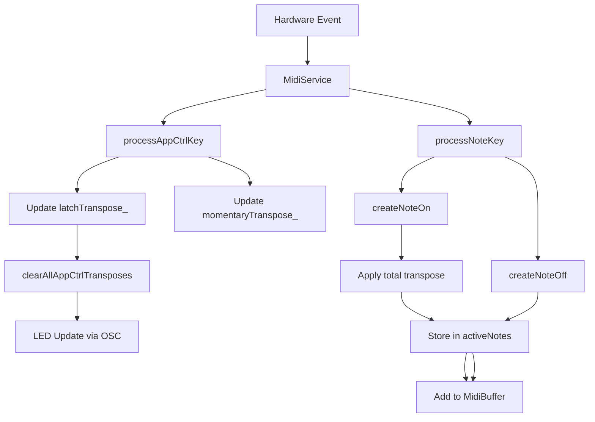

# Requirements

### Overview & Goals
Implement a "temporary" transposition system for "App Ctrl" keys. Unlike the global transpose setting, this transposition is intended for musical performance: it applies instantly to new notes but does not affect notes already being held.

### Functional Requirements
*   **Transpose Modes**: "App Ctrl" Transpose keys support three modes:
    *   **Latch**: Toggles a transpose value. Only one latch transpose can be active at a time per device.
    *   **Trigger**: Sets a transpose value instantly and deactivates all active latches on the current device.
    *   **Momentary**: Adds its value to the current transpose while held; stacks with latch/trigger values.
*   **Device Isolation**: Transpose state (latch and momentary) is independent for each device. Activating a transpose on one hardware controller does not affect others.
*   **Note Integrity**: Notes held during a transpose change remain at their original pitch until released, preventing hanging notes and unintended pitch-shifting of sustained notes.
*   **Total Transpose**: The effective transpose is the sum of the active Latch/Trigger value and all active Momentary values.
*   **Visual Feedback**: Active latch transpose keys are highlighted (Yellow) on the hardware controller.
*   **UI Configuration**: The Layout Editor's "App Ctrl" panel now includes mode selection when "Transpose" is chosen.

### Scope
*   **In Scope**: UI updates for mode selection, core transposition logic in `MidiService`, per-key note tracking for safe `NoteOff` handling, and LED feedback coordination.
*   **Out of Scope**: Changes to the "permanent" layout transpose setting or transposition for MPE expressions beyond initial pitch.

# Technical Design

### Current Implementation
*   `AppCtrl` keys currently support `Preset` switching and a basic `Transpose` stub.
*   `MidiService` handles note generation by reading from `ConfigLookup` and applying a fixed zone-based transpose.
*   `KeyState` tracks whether a key is active but doesn't store the exact MIDI notes sent.

### Proposed Changes

#### Data Model & Serialization
*   Update `AppCtrl` mapping string format: `Transpose;[Latch|Momentary|Trigger];[Value]`.
*   Update `ConfigLookup::Key` to store the mode in `cmdType` (reusing the existing command type field).

#### MidiService State
*   Add `int latchTranspose_[3]` and `int momentaryTranspose_[3]` to `MidiService` (one per instrument slot).
*   Update `KeyState` struct to include `int activeNotes[4]` to store the transposed note numbers used at `NoteOn`.

#### Transpose Logic
*   **Note Generation**: `createNoteOn` will sum `latchTranspose_[deviceIndex]` and `momentaryTranspose_[deviceIndex]` and apply this to the base note. The resulting pitch is stored in `activeNotes`.
*   **Note Release**: `createNoteOff` will use `activeNotes` to send the correct `NoteOff`, ensuring it matches the `NoteOn` pitch even if the transpose has changed.
*   **Mode Handling**: `processAppCtrlKey` will manage the `latchTranspose_` and `momentaryTranspose_` state for the specific device based on key events and modes.

#### Coordination & Feedback
*   `clearAllAppCtrlTransposes(int deviceIndex)`: Iterates through all `KeyState`s for the specified device to unlatch any active transpose keys and sends LED updates to that hardware via `oscBroadcastQueue_`.
*   `resendLEDs()`: Updated to check `isLatchOn` for `AppCtrl` Transpose keys.

### Architecture Diagram

### Risks & Mitigations
*   **Hanging Notes**: If `activeNotes` is not correctly cleared or matched, notes might hang. *Mitigation*: Initialize `activeNotes` to -1 and strictly use these values in `createNoteOff`.
*   **LED Desync**: Multiple devices might have latch keys. *Mitigation*: `clearAllAppCtrlTransposes` will be targeted to a specific device index to ensure only that device's LEDs are reset.

# Testing

### Validation Approach
Verification will be performed by code analysis and build testing, focusing on the logical flow of transpose application and note tracking.

### Key Scenarios
1.  **Latch Toggle**: Pressing a Latch +12 key, playing notes (transposed), then pressing it again to deactivate (notes return to normal).
2.  **Latch Replacement**: Activating Latch +12, then activating Latch -12. The first key should turn off, and the new transpose should be -12.
3.  **Momentary Stacking**: With Latch -12 active, holding a Momentary +5 key. Resulting transpose should be -7. Releasing the momentary key returns to -12.
4.  **Note Preservation**: Holding a note, changing transpose, and then releasing the note. The `NoteOff` must match the original `NoteOn`.
5.  **Trigger Cleanup**: Pressing a Trigger +0 key should clear any active Latch transpose.

# Delivery Steps

### ✓ Step 1: Update UI for App Ctrl Transpose modes
Enable configuration of Latch, Momentary, and Trigger modes for App Ctrl Transpose keys.

- Add mode selection toggle buttons (Latch, Momentary, Trigger) to `AppCtrlSectionComponent`.
- Update `AppCtrlSectionComponent::getMessageString` and `updatePanelFromMessageString` to handle the new 3-part string format: `Transpose;[Mode];[Value]`.
- Update `KeyConfigComponent::updateKeyText` to correctly display the transpose value on keys in the layout editor, ignoring the mode prefix.
- Ensure the UI components are correctly shown/hidden based on the selected App Ctrl type.

### ✓ Step 2: Core data model and state tracking implementation
Update `ConfigLookup` and `MidiService` to support the new transpose logic and per-key note tracking.

- Update `ConfigLookup::updateKeyUnlocked` to parse the new `AppCtrl` string format and store the mode in `cmdType`.
- Add `latchTranspose_[3]` and `momentaryTranspose_[3]` to `MidiService` to track the current temporary transpose state for each of the three supported instruments.
- Add `activeNotes[4]` to the `KeyState` struct in `MidiService.h` to store the actual MIDI notes triggered by each key.
- Initialize these new members in the `MidiService` constructor and `start` method.

### ✓ Step 3: Implement Transpose logic and Note handling
Implement the functional logic for temporary transposition and ensure hanging notes are avoided.

- Update `MidiService::createNoteOn` to calculate the combined transpose for the current device (latch + momentary), apply it to each note, and store the resulting notes in `KeyState::activeNotes`.
- Update `MidiService::createNoteOff` and `MidiService::createNoteHold` to use the stored `activeNotes` instead of recalculating from the layout, ensuring that note-offs always match their respective note-ons.
- Update `MidiService::processAppCtrlKey` to handle Latch, Momentary, and Trigger modes for Transpose, updating the device-specific `latchTranspose_` and `momentaryTranspose_` accordingly.
- Ensure Momentary transposes stack correctly by adding/subtracting on press and release.

### ✓ Step 4: Latch coordination and LED feedback implementation
Ensure only one latch is active at a time per device and provide visual feedback on the hardware.

- Implement `MidiService::clearAllAppCtrlTransposes(int deviceIndex)` to reset latch states for a specific device and trigger LED updates for affected keys on that device.
- Update `MidiService::resendLEDs` to highlight active App Ctrl Transpose latches in Yellow on the hardware.
- Integrate `clearAllAppCtrlTransposes` into `processAppCtrlKey` so that activating a new Latch or Trigger transpose clears previous latches on that same device.
- Verify that Preset switching logic in `PluginProcessor` remains functional and correctly distinguished from Transpose actions.